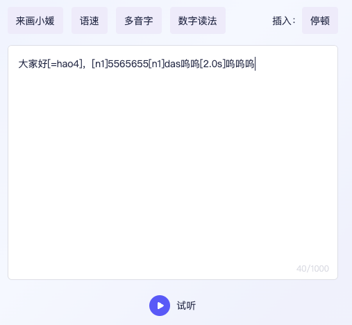

## 前言

今年元宇宙热潮下，我司也是快速调整了战略方向进军元宇宙行业。

在我司 3D 虚拟人播报场景中有个文本转语音的输入框，用户既可以编辑数字人播报的内容，还可以对其文本内容进行不同设置，比如说播报时的多音字读法、数字读法、播报时的停顿时间、数字人播报时的动作等等；

输入框现有实现为 `TextArea`, 业务表现为其在`TextArea`内容里是用`[` `]`进行包裹，播报时利用正则来获取`[` `]`里的具体内容来进行业务处理；

比如说多音字读法，`好`字为多音字，`好[=hao4]`为第四声的读法，然后编写正则来提取字符去走服务端生成音频进行播放；

后面产品说用括号包裹太丑了要加样式，这块就得全部推翻，然后这一块需求就分到了我头上

## 前期调研

0
