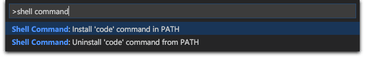

## 从命令行启动

还可以在将 'code' 添加到路径后从终端运行 VS Code：

* 打开 VS code.
* 打开 控制面板（⇧⌘P）并输入 ```shell command``` ,在提示里看到 `Shell Command: Install 'code' command in PATH`，运行它就可以了。



## 参考链接：

https://code.visualstudio.com/docs/setup/mac

