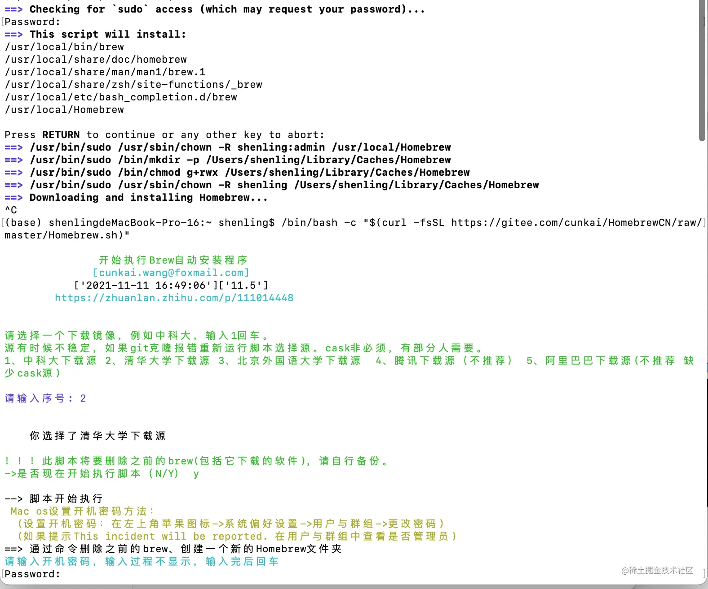

## Homebrew 是什么

> 官网链接：<https://brew.sh/index_zh-cn>

Homebrew是 mac的包管理器，仅需执行相应的命令,就能下载安装需要的软件包，可以省掉自己去下载、解压、拖拽(安装)等繁琐的步骤。 比如安装服务器 nginx，打开终端执行以下命令即可安装:

```shell
brew install nginx
```

## 安装

### 方法一 (官网命令)

```shell
/bin/bash -c "$(curl -fsSL https://raw.githubusercontent.com/Homebrew/install/HEAD/install.sh)"
```

### 方法二（国内源）

```shell
/bin/zsh -c "$(curl -fsSL https://gitee.com/cunkai/HomebrewCN/raw/master/Homebrew.sh)"
```



中途会很贴心的提示，需要选择哪个下载源，我尝试的时候，清华的是可以用的~如果一个失败了，建议换一个试一下
