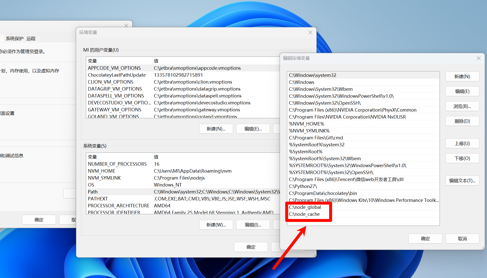

## windows配置npm全局下载和缓存目录

使用 NVM 管理 Node.js 的版本时，每次切换到不同的 Node 版本，NVM 会为每个版本创建一个独立的运行环境。这意味着每个版本的 Node.js 都有自己的全局 node_modules 目录，其中包括全局安装的包。因此，当你切换到一个新版本的 Node 时，之前版本所安装的全局包（如 yarn 和 pnpm）不会自动应用到新版本上。

所以维护独立的全局包目录。

### 新建目录

想指定的位置新建```node_global```和```node_cache```目录, 用来存放全局包和缓存；

### 修改npm配置

修改npm全局下载目录

```shell
npm config set prefix "C:\XXX\node_global"
```

修改npm全局缓存目录

```shell
npm config set cache "X:\XXX\node_cache"
```

查看修改后的配置

```shell
npm config list
```

### 配置坏境变量

在系统变量里```PATH``` 中添加目录```node_global```和```node_cache```


