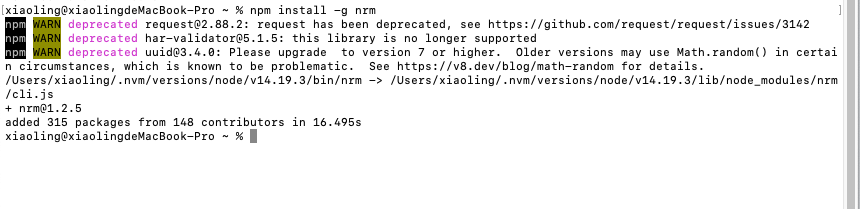

## nrm 是什么

npm 包有很多的镜像源，有的源有的时候访问失败，有的源可能没有最新的包等等，所以有时需要切换 npm 的源，nrm 包就是解决快速切换问题的。
nrm 可以帮助您在不同的 npm 源地址之间轻松快速地切换。

## 安装

```shell
  npm install -g nrm
```



### 验证是否安装成功

```shell
  nrm --v
```

出现版本号就说明安装好了

### 常用命令

- 查看所有源

```shell
  nrm ls
```

- 切换源

```shell
  nrm use taobao
```

- 显示当前源名称

```shell
  nrm current
```

- 添加源

```shell
 nrm add <registry> <url> [home]
```

`reigstry` 为源名，`url` 为源的路径， `home` 为源的主页(可不写)

- 删除源

```shell
 nrm del company
```

注：nrm del 命令不能删除 nrm 自己内置的源。

## nvm 是什么

> 官方 github：<https://github.com/nvm-sh/nvm>

nvm 是 nodejs 的版本管理工具，可以在一个环境中同时安装多个 nodejs 版本（和配套的 npm 版本），并随时切换。

好处是，开发调试不同 nodejs 应用变得更省心，随时切换所需要的版本。

## 安装(MAC)

> 注意： 有 node 需要先卸载

```shell
 curl -o- https://raw.githubusercontent.com/creationix/nvm/v0.33.8/install.sh | bash
 或者
 wget -qO- https://raw.githubusercontent.com/nvm-sh/nvm/v0.38.0/install.sh | bash
```

注：0.33.8 是版本，版本号换成最新的就行

## 安装(Windows)

win 版本点击链接 <https://github.com/coreybutler/nvm-windows/releases> 去下载安装即可使用

## 使用

- 常用命令

```shell
nvm version 查看当前的版本
nvm install 安装最新版本nvm
nvm install <version> 安装相应node版本
nvm use <version> 切换使用指定的版本node (mac中只是临时切换)
nvm ls 列出所有node版本
nvm ls-remote 列出所有远程node版本
nvm current 显示当前node版本
nvm uninstall <version> 卸载指定的node版本
```

- 设置默认的 node 版本

```shell
nvm alias default stable
```

## 问题

- M1芯片node版本在小于15.* 以下的都安装不了

通过nvm官网才知道，M1芯片的系统，node版本在小于15.* 以下的都安装不了，因为arm 64架构下是没有预编译 NodeJS 二进制文件的。

在64位X86体系结构下启动新的zsh进程：

```shell
arch -x86_64 zsh
```

注： `arch -x86_64 zsh`的时候会 `Bad CPU type in executable`， 是因为电脑上没有安装`Rosetta 2`，先`softwareupdate --install-rosetta`，然后再运行`arch -x86_64 zsh`就好了
