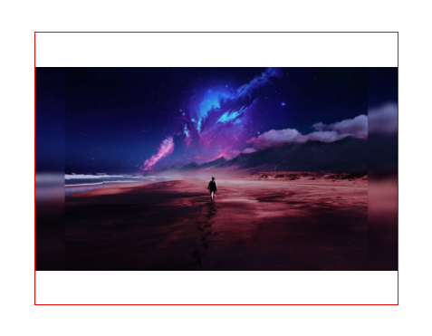
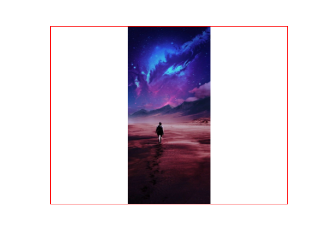

# 图片自适应容器

## 业务场景

已知容器的宽高，图片的宽高未知，需要在保持图片比例的情况下自适应显示在容器内

## 预期效果

红色方框是容器，里面是图片元素




## 实现过程

### 第一种：通过 css 属性 `object-fit: contain`

object-fit CSS 属性指定可替换元素的内容应该如何适应到其使用的高度和宽度确定的框, 一般用于 img 和 video 标签，一般可以对这些元素进行保留原始比例的剪切、缩放或者直接进行拉伸等。

```html
<style>
  .box {
    width: 400px;
    height: 300px;
    margin: 200px auto;
    border: 1px solid red;
  }
  .img {
    width: 100%;
    height: 100%;
    object-fit: contain;
  }
</style>
<div class="box">
  
</div>
```

### 第二种：通过给容器设置背景 `background-size: contain`

`background-size: contain` 把图像图像扩展至最大尺寸，以使其宽度和高度完全适应内容区域。故容器就会有留白

```html
<style>
  .box {
    width: 400px;
    height: 300px;
    margin: 200px auto;
    border: 1px solid red;
    /* background-repeat: no-repeat;
    background-size: contain;
    background-position: center; */
    /* 简写 */
    background: url("./111.jpg") no-repeat center / contain;
  }
</style>
<div class="box"></div>
```

### 第三种：flex 布局

这种方法前提要给图片宽高最大为`100%`

```html
<style>
  .box {
    width: 400px;
    height: 300px;
    margin: 200px auto;
    border: 1px solid red;
    display: flex;
    flex-direction: column;
    align-items: center;
    justify-content: center;
  }
  .img {
    max-width: 100%;
    max-height: 100%;
  }
</style>
<div class="box">
  
</div>
```

### 第四种：js 设置

图片`onload`事件之后读取图片元素的宽高及父元素的宽高，通过计算比例后设置`宽高`和`transform` 就可以了

这里使用`VUE3`指令的方式实现

```js
import { App } from "vue"
const imgAuto = {
  install(app: App): void {
    app.directive("imgAuto", {
      mounted(el: HTMLImageElement, binding) {
        el.onload = () => {
          const { clientWidth: parentWidth, clientHeight: parentHeight } = el.parentNode as HTMLElement
          const { width, height } = el
          let x = 0,
            y = 0,
            minThreshold = 0

          if (binding.value) {
            minThreshold = binding.value.minThreshold
          }

          // 得出容器的大小与图片大小的比例
          const wRatio = (parentWidth - minThreshold * 2) / width
          const hRatio = (parentHeight - minThreshold * 2) / height
          const fitRatio = hRatio < wRatio ? hRatio : wRatio
          // 算出高度宽度
          const newWidth = Math.round(width * fitRatio)
          const newHeight = Math.round(height * fitRatio)

          el.style.width = newWidth + "px"
          el.style.height = newHeight + "px"

          x = (parentWidth - newWidth) / 2
          y = (parentHeight - newHeight) / 2

          el.style.transform = `translateX(${x}px) translateY(${y}px)`
        }
      },
    })
  },
}
export default imgAuto

// 使用
import imgAuto from "./**/img-auto"
createApp(App).use(router).use(imgAuto).mount("#app")

```

## 最后

如果觉得有帮助请点个♥。

文章中有错误烦请指出。

有很好的实现方式一起交流。